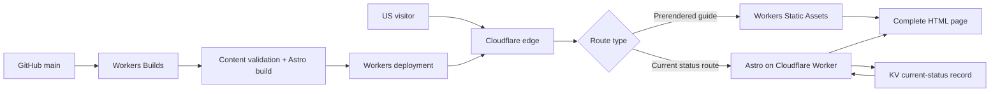

# Duskbloods Archive 建站详细设计

> 版本：v1.1
> 日期：2026-08-24
> 市场：United States / English
> 部署目标：Cloudflare Workers
> 页面策略：HTML 优先的混合渲染，静态内容预生成，时效页面由 Worker 按请求生成

## 0. 最终技术决定

### 采用

- **Astro + TypeScript**：内容型网站主体。
- **`@astrojs/cloudflare`**：Cloudflare 官方支持的 Astro 适配方式。
- **Astro Content Collections**：管理英文文章、来源、状态、更新时间和页面关系。
- **Cloudflare Workers Static Assets**：直接提供预生成 HTML、CSS、字体和图片。
- **Cloudflare KV**：只保存首页 Current Status Desk 的小型时效数据，不把整站内容放入数据库。
- **Workers Builds + GitHub**：预览、构建和正式发布。
- **Cloudflare Web Analytics**：首版基础访问统计；Google Search Console 和 Bing Webmaster Tools 用于搜索表现。

### 不采用

- 不使用 React 单页应用作为网站主体。
- 不使用 Next.js + OpenNext 作为首选。
- 首版不使用 D1、R2、Durable Objects、Queues 或独立 CMS。
- 不在浏览器加载整站内容后再渲染。
- 不做用户账号、评论、论坛和后台编辑器。

### 为什么选 Astro

Cloudflare 官方说明，Astro Cloudflare 适配器可让页面默认在 Worker 中按请求生成，也允许对不需要实时生成的路由设置预生成。这个能力与本站非常匹配：

- 大部分指南页内容稳定，预生成后可直接作为静态文件提供。
- 首页、网络测试和错误状态有时效性，可以按请求生成。
- 页面默认输出完整 HTML，不依赖大量浏览器脚本。
- 内容结构、来源列表、更新时间和相关页面适合用 Content Collections 管理。

Next.js 在 Workers 上也可行，但需要 OpenNext 适配层、额外构建产物和缓存配置。本站没有复杂应用状态、登录或大型 React 交互，使用 Next.js 会增加维护面，收益有限。

## 1. 产品目标

### 一句话定位

**Duskbloods Archive is a complete, source-tracked guide to The Duskbloods—covering current status, gameplay, characters, systems, and the road to release.**

### 用户在五秒内应当知道

1. 这是一个非官方英文资料站。
2. 内容基于 Nintendo、FromSoftware 和官方测试资料。
3. 当前网络测试发生了什么。
4. 可以在哪里查看玩法、角色和发售信息。
5. 每个重要结论何时最后核对。

### 成功条件

- 正面覆盖 `duskbloods`、`release date`、`gameplay`、`characters`、`network test` 等核心主题。
- 10 个首发页面各自解决一个清晰问题，没有等待填充的空页面。
- 时效内容可以在不改整篇文章的情况下快速更新。
- 用户可以区分官方确认、测试版内容、玩家报告和未确认信息。
- 页面即使禁用 JavaScript，主要内容和导航仍可使用。
- 视觉上不能像通用 Wiki 模板；首屏、系统图解和页面转场应当让用户一眼联想到 Duskbloods 的月夜、血誓、哥特城市与四阶段淘汰。
- 在相同桌面和手机尺寸下与 `duskbloodswiki.com`、`duskbloodsguide.com`、`duskbloods.net` 并排比较时，本站在信息清晰度、视觉辨识度、可信度和动效完成度上必须明显更强。

## 2. 总体架构



### 请求处理原则

- 静态资源优先，不需要 Worker 的页面不运行 Worker。
- Worker 只处理真正需要读取 KV 或按请求生成的页面。
- 内容文章从 Git 仓库发布，保证修改可审查、可回滚。
- KV 只存短小的当前状态，不成为文章事实的唯一来源。
- KV 读取失败时，页面显示构建时携带的最后已知状态，不返回空白页。

## 3. 渲染方式

| 路径 | 首版方式 | 原因 | 更新方式 |
| --- | --- | --- | --- |
| `/` | Worker 按请求生成，边缘短缓存 | 首页包含 Current Status Desk | 更新 KV 或重新部署 |
| `/network-test/` | Worker 按请求生成，边缘短缓存 | 测试结论和官方回应仍可能变化 | 更新 KV + 内容部署 |
| `/network-test/errors/` | Worker 按请求生成，边缘短缓存 | 登录与服务器状态有时效性 | 更新 KV + 内容部署 |
| `/gameplay/` | 预生成 | 官方玩法资料稳定、内容较长 | Git 内容更新后部署 |
| `/release-date/` | 预生成；重大变化时重新部署 | 准确性比分钟级实时更重要 | Git 内容更新后部署 |
| `/characters/` | 预生成 | 资料型页面 | Git 内容更新后部署 |
| `/weapons-and-powers/` | 预生成 | 资料型页面 | Git 内容更新后部署 |
| `/kin/` | 预生成 | 资料型页面 | Git 内容更新后部署 |
| `/systems/` | 预生成 | 资料型页面 | Git 内容更新后部署 |
| `/switch-2/` | 预生成 | 购买前判断页 | Git 内容更新后部署 |
| `/about/`、政策页 | 预生成 | 基本不变 | Git 内容更新后部署 |
| `/sitemap-index.xml` | 构建生成 | 与实际页面保持一致 | 每次部署 |

### 缓存目标

- 指纹化 CSS、JavaScript、字体和图片：浏览器与边缘长期缓存。
- 预生成 HTML：Cloudflare 静态资源直接提供；发布后文件更新即失效。
- 首页、测试页、错误页：边缘缓存 5 分钟，允许短时间使用旧内容。
- KV 状态数据：页面生成时读取；发生官方重大事件时主动清理对应页面缓存。
- 不使用“缓存所有内容”的宽泛规则，避免政策页、404 或未来表单被错误缓存。

## 4. 内容数据模型

每篇内容必须包含以下信息：

| 字段 | 用途 | 必填 |
| --- | --- | --- |
| `title` | 页面标题与主标题基础 | 是 |
| `description` | 搜索摘要 | 是 |
| `slug` | 页面地址 | 是 |
| `pageType` | home / status / guide / reference / policy | 是 |
| `primaryIntent` | 页面解决的核心问题 | 是 |
| `status` | confirmed / test-build / player-reported / unconfirmed | 是 |
| `publishedAt` | 首次发布日期 | 是 |
| `updatedAt` | 内容更新时间 | 是 |
| `lastCheckedAt` | 最后核对事实日期 | 是 |
| `primarySource` | 最主要的一手来源 | 是 |
| `sources` | 完整来源列表 | 是 |
| `directAnswer` | 开头直接答案 | 是 |
| `relatedSlugs` | 相关文章 | 是 |
| `changeLog` | 重要事实的变化记录 | 时效页必填 |
| `draft` | 不进入正式构建 | 是 |
| `noindex` | 是否允许被搜索 | 是 |

### 来源对象

- 名称。
- 原始链接。
- 来源方。
- 来源类型：official / support / official-media / reporting / community。
- 发布时间。
- 本站最后访问时间。
- 支持哪一条事实。

### Current Status KV 记录

只保存：

- `state`：normal / monitoring / incident / concluded。
- `headline`：一句当前状态。
- `summary`：最多两句。
- `updatedAt`：更新时间。
- `sourceUrl`：主要来源。
- `sourceLabel`：来源名称。
- `nextCheckAt`：下一次人工核对时间。

KV 中不保存整篇文章、不保存密钥、不保存用户数据。

## 5. 信息架构与导航

### 桌面主导航

- Home
- Network Test
- Gameplay
- Characters
- Release

### More 菜单

- Weapons & Powers
- Kin
- Systems
- Switch 2
- Editorial Policy

### 手机导航

- 顶部只显示品牌、Current Status 入口和菜单按钮。
- 菜单展开后按 Core Guides、Game Systems、Site 分组。
- 不在首版加入站内搜索；10–15 个页面用清晰导航更快。

## 6. 首发路由与页面职责

### 6.1 首页 `/`

目标词：`duskbloods`、`the duskbloods`。

页面顺序：

1. 安静的品牌导航。
2. 主视觉与 H1。
3. Current Status Desk。
4. Platform / Developer / Release 三项事实。
5. Start Here：Network Test、Gameplay、Characters 三个主入口。
6. Complete Guide Index：其余核心指南列表。
7. Latest verified changes：最近三次事实更新。
8. Source discipline：四级证据说明。
9. 官方来源与非官方声明。
10. 页脚。

首屏固定文案：

- Brand：`DUSKBLOODS ARCHIVE`
- H1：`The Duskbloods: What We Know After the Network Test`
- Body：`Confirmed details, test findings, and the road to release—without rumor presented as fact.`
- Primary CTA：`Read the network test recap`
- Secondary CTA：`Explore confirmed game details`
- Trust line：`Unofficial fan guide · Sources linked on every page`

### 6.2 Network Test `/network-test/`

首屏直接回答测试是否结束、时间和下一步。

结构：Current status、五场美国 PDT 时间线、报名与下载码状态、测试目标、发生的问题、官方回应、测试版限制、后续可能变化、来源、更新历史。

### 6.3 Errors `/network-test/errors/`

不是普通新闻稿，而是问题处理页。

结构：当前是否仍有事件、错误原文、官方确认内容、用户可以做什么、不应该做什么、错误上报入口、事件时间线、相关新闻来源、更新记录。

不得保证某个操作“一定修复服务器错误”。

### 6.4 Gameplay `/gameplay/`

用“一局比赛怎样进行”作为主线：House of Night → 三个阶段 → Virtue → Alliances / Sigils → Final Phase。

提供术语索引，但不把每个术语拆成薄页。

### 6.5 Release Date `/release-date/`

第一句话固定说明：官方只确认 2026，尚无准确日期。

包含被否认的 9 月 24 日说法、官方来源、平台、是否可预购、更新订阅建议和变化记录。

### 6.6 Characters `/characters/`

页面标题使用用户熟悉的 Characters，正文解释官方术语 Bloodsworn。

每个角色条目只展示已确认的名称、武器、技能、测试版状态和来源。不为未知角色创建独立地址。

### 6.7 Weapons & Powers `/weapons-and-powers/`

合并武器、Alchemy Forge、Powers of Blood 和强化规则。首版不做“最佳武器”排行。

### 6.8 Kin `/kin/`

解释 Ring、Blade、Eye 三类召唤圈、八种测试版 Kin、成长与重新召唤。区分测试版和正式版。

### 6.9 Systems `/systems/`

将 Virtue、Alliances、Sigils 放在一张可互相对照的系统页中，避免三个内容不足的页面。

### 6.10 Switch 2 `/switch-2/`

解决独占、Nintendo Switch Online、最多玩家数量、支持模式、单人相关已确认信息。没有官方确认的功能必须标记未知。

## 7. 页面模板

### 7.1 Homepage 模板

```text
┌──────────────────────────────────────────────────────────────┐
│ Brand        Home  Network Test  Gameplay  Characters  Release│
├──────────────────────────────────────────────────────────────┤
│ H1 + summary + actions          Original editorial artwork   │
│                                  no text inside image         │
├──────────────────────────────────────────────────────────────┤
│ CURRENT STATUS     headline     source     last checked       │
├──────────────────────────────────────────────────────────────┤
│ Platform           Developer    Release                       │
├──────────────────────────────────────────────────────────────┤
│ Start here:  Network Test  /  Gameplay  /  Characters        │
├──────────────────────────────────────────────────────────────┤
│ Complete guide index — open editorial list, not card wall     │
├──────────────────────────────────────────────────────────────┤
│ Latest verified changes — dated timeline                     │
├──────────────────────────────────────────────────────────────┤
│ Source discipline + unofficial statement + footer            │
└──────────────────────────────────────────────────────────────┘
```

### 7.2 Guide 模板

```text
┌──────────────────────────────────────────────────────────────┐
│ Header                                                       │
├──────────────────────────────────────────────────────────────┤
│ Breadcrumb                                                   │
│ H1                                                           │
│ Direct answer                                                │
│ Status / Last checked / Primary source                       │
├───────────────────────────────────────┬──────────────────────┤
│ Main article                           │ On this page         │
│ confirmed facts                       │ Related guides       │
│ explanation / tables / timeline       │                      │
│ what remains unknown                  │                      │
├───────────────────────────────────────┴──────────────────────┤
│ Sources                                                      │
│ Change log                                                   │
│ Next guide                                                   │
└──────────────────────────────────────────────────────────────┘
```

### 7.3 Status / Incident 模板

```text
┌──────────────────────────────────────────────────────────────┐
│ H1 + current state + last verified time                      │
├──────────────────────────────────────────────────────────────┤
│ Direct answer / what players should do now                   │
├──────────────────────────────────────────────────────────────┤
│ Event timeline                                               │
│ time ─ official update ─ impact ─ source                     │
├──────────────────────────────────────────────────────────────┤
│ Confirmed / Player reported / Unknown                        │
├──────────────────────────────────────────────────────────────┤
│ Official support links + change log                          │
└──────────────────────────────────────────────────────────────┘
```

## 8. 视觉系统

### 8.1 设计概念

**Blood Oath Observatory / 血誓观测档案**：以高级游戏杂志和调查档案为信息骨架，以月相、圣堂门廊、血誓关系和四阶段淘汰为视觉语言。它应当属于 Duskbloods 的世界，但不复制游戏官网、不照搬官方标志或角色形象。

- 首页像进入一座被月光切开的档案馆：巨大的暗月、纵向门廊和远处城市构成一个清晰焦点。
- 页面向下滚动时，一条细窄的“血誓线”串联 Current Status、玩法阶段、更新历史和来源，不堆无意义装饰。
- 日期、来源、确认状态和测试版边界直接进入版式，形成本站最重要的可信度特征。
- 原创氛围图只承担情绪，不冒充游戏截图；官方截图只用于说明具体事实并标注来源。
- 页面保留大面积安静黑场、非对称构图与明显的纵向节奏，不做常见的圆角卡片墙。

### 8.2 来自游戏本体的视觉母题

依据 Nintendo 官方产品页和官方 Network Test Gameplay Guide，首版固定采用以下母题：

| 游戏母题 | 本站转译 | 使用位置 | 禁止做法 |
| --- | --- | --- | --- |
| 暗月与 Moon Blood Bestowal | 缺月圆盘、月蚀式章节编号、由暗到亮的阅读进度 | 首页首屏、Final Phase、章节切换 | 不复制官方标志，不做廉价发光月亮 |
| 哥特城市、钟楼与圣堂 | 高耸窄栏、尖拱裁切、纵向门廊比例 | 主图边框、导航、文章章节入口 | 不把每个容器都做成哥特边框 |
| Bloodsworn 与血誓 | 一条克制的暗红关系线，连接人物、联盟、Sigil 与来源 | 时间线、系统图、相关文章 | 不用滴血字、血浆纹理或恐怖片字体 |
| 四阶段 Dusk Battle | Phase I–III 与 Final 的纵向淘汰轨道 | Gameplay 核心图解、首页快速入口 | 不用普通四张功能卡代替流程 |
| Alliances / Sigils | 交叉但可读的关系线与可聚焦节点 | Systems 页交互图解 | 不做需要拖拽缩放的复杂关系图 |
| Virtue 与圣杯筛选 | 上升刻度、排名截线、三人进入终局的收束构图 | Gameplay、Systems | 不伪造数值或游戏界面 |
| 烛火、雾与金属 | 极弱暖光、灰紫雾层、磨损银线 | 背景层、分隔、悬停反馈 | 不做满屏粒子、火焰或高强度噪点 |

视觉色调以官方页面所呈现的黑、尘红、灰紫月光、旧银与暖烛光为依据，但构图、插画和界面必须原创。

### 8.3 超越三个竞品的设计标准

| 维度 | 三个现有独立站暴露出的机会 | 本站要求 |
| --- | --- | --- |
| 第一印象 | 新站或通用资料站感明显，品牌记忆较弱 | 5 秒内看出是 Duskbloods 专题站，而不是可换游戏名的模板 |
| 内容入口 | 以普通栏目或卡片为主 | 用 Current Status、四阶段流程和 Guide Index 三条明确路径承接不同意图 |
| 可信度 | 事实、来源、更新时间容易分离 | 重要结论旁直接显示状态、核对时间和一手来源 |
| 游戏理解 | 主要依赖文字罗列 | 用定制的 Dusk Battle、Virtue、Alliance、Sigil 图解帮助理解 |
| 动效 | 缺少或使用模板式悬停 | 动效服务于“进入月夜档案、沿血誓线推进”的叙事，不喧宾夺主 |
| 手机体验 | 常见的桌面布局压缩 | 手机首屏仍保留月门构图、直接答案和当前状态，不牺牲氛围与速度 |

视觉验收必须做四张同尺寸并排截图：本站首页与三个竞品各一张；另做本站 390px 手机截图。若遮住站名后仍像通用游戏 Wiki，视为不通过。

### 8.4 颜色

| 名称 | 值 | 用途 |
| --- | --- | --- |
| Ink | `#0B0B0D` | 页面主背景 |
| Raised Ink | `#141417` | 状态区和移动菜单 |
| Bone | `#EFE9DD` | 主文字 |
| Ash | `#A7A39C` | 次文字 |
| Silver | `#72747A` | 分隔线和辅助信息 |
| Moonlight | `#C4C2D2` | 月相、高亮数字和焦点外框 |
| Bruise | `#4B4055` | 雾层、次级渐变与关系图背景 |
| Blood | `#8D1F2D` | 主按钮、重要事件 |
| Blood Hover | `#A62A3A` | 交互状态 |
| Candle | `#B48A5A` | 极少量暖光和历史节点 |
| Confirmed | `#6F8B75` | 已确认状态，同时配文字 |
| Warning | `#B58A52` | 玩家报告和待确认状态 |

不使用大面积红色背景，不用纯黑配纯白造成刺眼阅读。

### 8.5 字体

- Display：Newsreader，600–700，用于 H1、H2 和重要数字。
- UI / Body：IBM Plex Sans，400–600，用于正文、导航、标签和表格。
- 字体自托管，只包含英语所需字符和实际使用字重。

### 8.6 字号

| 用途 | Desktop | Mobile |
| --- | ---: | ---: |
| Hero H1 | 68–76px | 42–48px |
| Page H1 | 52–60px | 36–42px |
| H2 | 36–42px | 29–34px |
| H3 | 22–26px | 21–24px |
| Body large | 20px / 1.55 | 18px / 1.55 |
| Body | 17px / 1.7 | 16px / 1.7 |
| UI | 14px / 1.4 | 14px / 1.4 |
| Caption | 12–13px | 12–13px |

### 8.7 布局

- 最大页面宽度：1280px。
- 文章正文：680–760px。
- 文章右侧目录：260px，桌面显示；手机折叠为正文前的目录按钮。
- 桌面左右留白：至少 48px；手机：20px。
- 主要区块垂直间距：96–128px；手机：64–80px。
- 边角半径：按钮 2px；状态框 0–2px；图片框 0px。
- 阴影极少，仅移动菜单可使用轻微阴影。

### 8.8 图标

只使用必要图标：菜单、关闭、外链、箭头、展开、复制链接。

- 统一 1.5px 线条。
- 16px 与 20px 两种尺寸。
- 不使用通用游戏徽章、盾牌、血滴或骷髅作为无意义装饰。
- Sigil 和 Kin 类型只在解释真实玩法关系时使用原创线形符号，并同时显示文字名称。

### 8.9 动效系统

动效目标不是“让页面一直动”，而是让用户感到自己从月门进入档案，并沿着一条血誓线逐层发现事实。

| 场景 | 动效 | 时长与约束 |
| --- | --- | --- |
| 首页首次进入 | 暗月与门廊轻微错层出现，标题从黑场中显现 | 700–900ms，只执行一次；不阻塞阅读 |
| 背景氛围 | 雾层极慢横移，月盘只有 1–2% 视差 | 12–18s 循环；手机关闭视差 |
| 区块进入 | 细红线先出现，标题与内容随后淡入 | 450–700ms；一次最多一组，不连续弹跳 |
| Dusk Battle 图解 | 阅读到对应阶段时，淘汰轨道向下推进并收束到最终三人 | 只改变线条进度、透明度和位置；内容始终可直接阅读 |
| Alliance / Sigil 图解 | 键盘聚焦或指针悬停某节点时，只点亮相关关系 | 160–220ms；非相关内容降低但不消失 |
| Current Status 更新 | 状态边线单次扫过并显示更新时间 | 不做无限闪烁、呼吸灯或假实时提示 |
| 链接与按钮 | 下划线像刀锋从左向右划入，按钮产生 1–2px 位移 | 140–180ms；不缩放整块内容 |
| 页面切换 | 支持时使用轻微交叉淡化，地址和焦点行为保持正常 | 180–240ms；渐进增强，失败时直接切页 |

实现限制：

- 只对 `transform`、`opacity` 和必要的 SVG 线条进度做动画，避免滚动卡顿。
- 不使用 WebGL、全屏视频、鼠标跟随光标、大型粒子库或持续抖动。
- 不为了动效引入大型脚本；核心内容在动画运行前已经存在于完整 HTML 中。
- `prefers-reduced-motion` 下关闭视差、雾层移动、绘线和页面切换，所有状态立即显示。
- 动画结束后不改变正文位置，避免阅读中发生布局跳动。
- 手机低性能模式只保留按钮、菜单和必要状态反馈。

## 9. 核心组件

### 全站组件

- `SiteHeader`
- `MobileNavigation`
- `SiteFooter`
- `Breadcrumbs`
- `PrimaryButton` / `TextLink`
- `StatusLabel`
- `EvidenceStamp`
- `SourceList`
- `ChangeLog`
- `RelatedGuides`
- `PageTableOfContents`

### 首页组件

- `MoonGateHero`：暗月、门廊、标题和双入口构成的本站签名首屏。
- `CurrentStatusDesk`
- `FactStrip`
- `StartHereRail`
- `GuideIndex`
- `BloodlineTimeline`：以血誓线串联已核对变化，不做普通圆点时间线。
- `EvidenceMethod`

### 内容组件

- `DirectAnswer`
- `ConfirmedFacts`
- `UnknownsBoundary`
- `RumorCorrection`
- `EventTimeline`
- `DefinitionList`
- `ComparisonTable`
- `OfficialSupportCallout`
- `DuskBattleRail`：四阶段淘汰与最终三人的核心图解。
- `VirtueThreshold`：解释 Virtue 排名截线，不显示未经确认的游戏数值。
- `SigilRelations`：键盘和触控可用的关系图解。
- `EvidenceLedger`：把结论、来源、核对日期和可信状态放在同一阅读单元。

### 组件规则

- `StatusLabel` 必须同时显示文字，不能只用颜色。
- `DirectAnswer` 必须出现在文章首屏内。
- `SourceList` 不隐藏在折叠区域。
- `UnknownsBoundary` 明确列出尚未知的信息，防止用户把缺失内容当作否定结论。
- `RumorCorrection` 必须同时显示误传、官方现状和核对来源。

## 10. 响应式设计

### Desktop：1280–1440px

- 首页英雄区 48 / 52 分栏。
- 文章采用正文 + 右侧目录。
- Current Status Desk 横向呈现状态、更新时间、来源。

### Tablet：768–1024px

- 首页英雄区保持分栏，但插图比例下降。
- 文章目录移动到正文前。
- Guide Index 从双列变成单列分组。

### Mobile：360–430px

- 英雄区改为文字在前、插图在后。
- H1 最多五行，按钮纵向排列。
- 状态区顺序为状态 → 摘要 → 时间 → 来源。
- 表格允许横向滚动，并提供首列固定或改为定义列表的移动版本。
- 页面底部不使用遮挡内容的固定按钮。

### 移动首屏线框

```text
┌──────────────────────────┐
│ DUSKBLOODS       STATUS ☰│
├──────────────────────────┤
│ The Duskbloods:          │
│ What We Know After       │
│ the Network Test         │
│                          │
│ Confirmed details...     │
│ [Read the recap]         │
│ Explore details →        │
│                          │
│ Original artwork         │
├──────────────────────────┤
│ CURRENT STATUS           │
│ Test concluded           │
│ Last checked / source    │
└──────────────────────────┘
```

## 11. 交互与无障碍

- 所有交互可以用键盘完成。
- 跳到正文链接是页面第一个可聚焦元素。
- 焦点样式使用 Bone 外框和 Blood 辅助线，不移除默认可见焦点。
- 导航菜单打开时锁定背景滚动并把焦点限制在菜单内。
- `aria-current` 标识当前页面。
- 外链图标不能代替“Official source”等文字。
- 动画遵守第 8.9 节的层级和预算；任何动效关闭后都不影响信息理解。
- 正文链接始终有下划线，不只依靠颜色。
- 图片必须有准确替代文字；纯氛围图可使用空替代文字。
- 不自动播放视频或音频。

## 12. 搜索设计

### 页面基础

- 每页唯一标题、摘要和 H1。
- 主词靠近标题开头，但不堆叠同义词。
- 每页固定规范地址。
- 自动生成 sitemap index、内容 sitemap 和 robots.txt。
- 草稿、预览地址和重复页面不可被搜索。
- 404 返回真实 404 状态和自定义页面。

### 结构化信息

- 全站：Organization / WebSite 的非官方站点信息。
- 首页：VideoGame，仅填写官方确认字段。
- 指南：Article + BreadcrumbList。
- 事件时间线：Article 内的可见日期，不虚构 Event。
- FAQ 只有页面真的显示问答时才添加，且不为结构化信息单独制造内容。

### 内部连接

- 首页连接全部 10 个首发页面。
- 每篇指南至少连接 2 个相邻主题。
- Network Test 和 Errors 双向连接。
- Gameplay 连接 Characters、Weapons、Kin、Systems。
- Release Date 连接 Switch 2 和首页。
- 锚文本描述目的，不使用重复的 “click here”。

### 发布检查

- 标题约 50–60 个英文字符，必要时以准确性优先。
- 摘要约 145–160 个英文字符，不写未确认日期。
- 开头 120 个词内给直接答案。
- 每个重要事实旁或章节末有来源。

## 13. Cloudflare Workers 详细设计

### Worker 配置原则

- 新项目使用当天的 compatibility date，并定期更新。
- 启用 `nodejs_compat`，避免依赖库运行差异。
- 使用 `wrangler.jsonc`，并引用本地配置结构定义。
- 通过 `wrangler types` 生成绑定类型，不手写环境绑定定义。
- 开启 Workers 日志与追踪，并设置合理采样率。
- 密钥只通过 Cloudflare Secrets 管理；首版预计没有业务密钥。

### 绑定

| 名称 | 类型 | 用途 |
| --- | --- | --- |
| `SITE_STATUS` | KV | 首页、测试页和错误页的当前状态 |
| `ASSETS` | Static Assets | 构建后的 HTML、CSS、字体和图片 |

### Worker 行为

- 不在模块全局保存请求状态。
- 所有异步操作都等待完成或明确交给请求结束后的任务。
- KV 读取设置超时与安全回退。
- 错误响应不暴露内部路径、配置或异常堆栈。
- 使用结构化日志记录路径、状态、缓存结果和错误类别，不记录用户完整 IP。
- Worker 内调用 Cloudflare 服务使用绑定，不调用 Cloudflare REST API。

### 安全响应头

- Content Security Policy。
- Referrer Policy：`strict-origin-when-cross-origin`。
- `X-Content-Type-Options: nosniff`。
- 使用 CSP 的 `frame-ancestors` 限制嵌入。
- Permissions Policy 关闭不需要的摄像头、麦克风和定位。
- HSTS 在自定义域名和 HTTPS 完成验证后启用。

## 14. 图片和字体

- 原创主视觉输出 AVIF 和 WebP，保留 PNG 原件但不直接上线。
- 首页主图提供 640、960、1280 三档宽度。
- 首页主视觉必须是原创的“月门 / 城市 / 远行者”氛围构图，不包含官方 Logo，也不复刻可识别角色。
- Gameplay 需要一张可缩放的四阶段流程图；Systems 需要一张 Alliance / Sigil 关系图；两者优先使用轻量矢量与可读文字，而不是把信息烘焙进图片。
- 文章图默认延迟加载，首屏主图不延迟。
- 所有图片声明宽高，避免页面跳动。
- 不从第三方站点热链图片。
- 官方截图只有在使用边界明确时才进入内容，并标注来源。
- 字体放在本站静态资源中，不依赖 Google Fonts 请求。

## 15. 性能预算

| 指标 | 首版预算 |
| --- | ---: |
| 首屏关键 JavaScript | 30KB gzip 以内 |
| 全页 JavaScript | 70KB gzip 以内 |
| 首屏图片 | 250KB 以内 |
| 单张内容图 | 180KB 以内 |
| 字体总传输 | 160KB 以内 |
| 页面初始总传输 | 700KB 以内 |
| 页面布局跳动 | 接近 0 |
| 持续运行的背景动效 | 最多 1 层 |

不为了动画引入大型前端库。导航、目录和少量展开行为使用 Astro islands 或轻量原生脚本。

## 16. 统计与搜索验证

### Day 0

- Cloudflare Web Analytics。
- Google Search Console。
- Bing Webmaster Tools。
- 记录 10 个首发页面地址、目标主题和上线时间。

### 事件

只记录必要的匿名行为：

- 首页主按钮点击。
- Current Status 来源点击。
- Guide Index 页面点击。
- 官方来源外链点击。
- 文章阅读到 50% 和 90%。

不采集表单、账号或个人资料，因为首版没有这些功能。

## 17. 项目目录设计

```text
duskbloods/
├── docs/
│   ├── REQUIREMENTS.md
│   ├── DETAILED_DESIGN.md
│   ├── evidence/
│   └── concepts/
├── public/
│   ├── fonts/
│   ├── images/
│   ├── favicon.svg
│   └── _headers
├── src/
│   ├── components/
│   │   ├── layout/
│   │   ├── content/
│   │   ├── status/
│   │   └── seo/
│   ├── content/
│   │   ├── guides/
│   │   ├── policies/
│   │   └── config.ts
│   ├── data/
│   │   ├── fallback-status.json
│   │   └── navigation.ts
│   ├── layouts/
│   ├── pages/
│   ├── styles/
│   └── utils/
├── tests/
│   ├── content/
│   ├── runtime/
│   └── browser/
├── astro.config.mjs
├── wrangler.jsonc
├── package.json
└── README.md
```

## 18. 内容发布流程

1. 新建或修改 Markdown / MDX 内容。
2. 填写直接答案、状态、核对日期和来源。
3. 运行来源与内容字段检查。
4. 运行类型检查、页面构建和链接检查。
5. 在 Workers 本地运行环境中预览。
6. 检查桌面和手机页面。
7. 推送功能分支，生成预览版本。
8. 人工检查预览。
9. 合并到 main，由 Workers Builds 发布。
10. 检查线上页面、响应状态、来源链接和站点地图。

### 紧急状态更新

发生服务器事故时：

1. 从官方渠道确认事实。
2. 更新 KV 的当前状态。
3. 清除首页、测试页和错误页的短缓存。
4. 更新完整事件页面并走正常 Git 发布。
5. 状态恢复后保留事件时间线，不删除历史事实。

## 19. 构建与部署

### 环境

- Node.js 22.12 或更高的 22.x 版本。
- npm 锁文件必须与依赖清单一致。
- 本地开发使用 Astro 开发服务器。
- 发布前必须使用 Cloudflare 的运行环境预览，不能只在普通 Node 环境中检查。

### Workers Builds

- Production branch：`main`。
- Build command：安装锁定依赖并运行 Astro build。
- Deploy command：Wrangler deploy。
- 非 main 分支：创建可访问的预览版本，不直接替换正式站。
- 第一次绑定自定义域名前，先在 workers.dev 地址完成检查。

### 回滚

- 每次正式发布保留前一版本。
- 自定义域名切换前保留 workers.dev 预览。
- 发布后若首页、关键指南或来源链接异常，立即回退上一版本。
- Git 回退、Worker 版本回退和域名切换分别记录，不能混为一个动作。

## 20. 检查与验收

### 内容

- 10 个首发页面全部存在并有完整正文。
- 没有未来日期、空来源或重复主意图。
- `duskbloods` 与 `the duskbloods` 只由首页承接。
- 正式发售日只写官方确认状态。
- 测试版内容明确标记可能变化。

### 页面

- 桌面 1440px、笔记本 1280px、平板 768px、手机 390px 实际查看。
- 导航、目录、来源、相关页面和外链全部点击。
- JavaScript 关闭后主要内容仍可阅读。
- 没有横向溢出、文字截断、图片变形和不可见焦点。
- 与三个竞品完成桌面同尺寸并排检查，本站首屏具备明确的 Duskbloods 视觉辨识度。
- 遮住站名后仍能从月门、四阶段轨道、血誓关系和证据档案结构判断本站主题。
- 动效关闭、系统减少动态效果、手机低性能三种状态下，内容和操作都完整。
- 页面滚动时没有明显卡顿，动效不抢夺阅读焦点，也不制造假实时感。

### Cloudflare

- 预生成页面由静态资源直接提供。
- 三个时效路由经过 Worker 并正确读取 KV。
- KV 故障时显示最后已知状态。
- 自定义 404 返回 404。
- 安全响应头存在。
- 日志不含密钥和个人资料。
- workers.dev 预览验证后才连接正式域名。

### 搜索

- 标题、摘要、H1 和规范地址正确。
- sitemap 只包含可搜索正式页面。
- robots 不阻止正式内容。
- 预览地址和草稿不可被搜索。
- 结构化信息与页面可见内容一致。

### 交付状态必须分开报告

- 详细设计完成。
- 视觉概念完成。
- 本地网站完成。
- 本地检查通过。
- Git 提交完成。
- GitHub 推送完成。
- Workers 部署完成。
- 自定义域名上线完成。
- 线上页面验证完成。

## 21. 实施顺序

### Phase 1：设计锁定

- 生成首页“月门”首屏、Current Status + Bloodline Guide Index、Gameplay 四阶段文章模板、390px 手机首页四张视觉稿。
- 确认字体、色彩、间距、插图处理和可见文案。
- 输出独立主视觉资产。
- 与三个竞品做同尺寸截图对照；未达到第 8.3 节的标准不得进入实现。
- 单独演示标准动态效果与 reduced-motion 静态效果，二者都通过后锁定设计。

### Phase 2：基础工程

- 建立 Astro + Cloudflare 项目。
- 完成内容模型、全局布局、导航、页脚和搜索基础。
- 配置 Workers Static Assets、KV、日志和预览部署。

### Phase 3：第一批内容

- Home。
- Network Test。
- Network Test Errors。
- Gameplay。
- Release Date。

### Phase 4：第二批内容

- Characters。
- Weapons & Powers。
- Kin。
- Systems。
- Switch 2。

### Phase 5：验证与上线

- 内容与来源检查。
- Workers 运行环境检查。
- 桌面与手机视觉检查。
- workers.dev 预览。
- 自定义域名连接与线上复查。

## 22. 当前阻碍与不阻碍事项

### 当前阻碍

内置视觉生成服务在 2026-08-24 再次返回服务错误，因此四张正式视觉稿尚未生成。根据设计规范，在视觉稿完成并接受前不开始页面实现。

备用的命令行视觉生成方式需要本机配置 OpenAI API 密钥；未得到用户明确选择前不启用。

### 不阻碍

- 技术栈选择已完成。
- 页面、组件、内容模型、视觉母题、动效、缓存、部署和验收设计已完成。
- 官方 Cloudflare 与 Astro 的当前说明已经核对。
- 视觉服务恢复后可以直接使用本文件中的固定文案和设计系统生成概念稿。

## 23. 官方技术依据

- [Cloudflare Workers：Astro 指南](https://developers.cloudflare.com/workers/framework-guides/web-apps/astro/)
- [Astro：Cloudflare 适配器](https://docs.astro.build/en/guides/integrations-guide/cloudflare/)
- [Cloudflare Workers Static Assets 路由](https://developers.cloudflare.com/workers/static-assets/routing/worker-script/)
- [Cloudflare Workers 最佳实践](https://developers.cloudflare.com/workers/best-practices/workers-best-practices/)
- [Cloudflare Workers：Next.js 指南](https://developers.cloudflare.com/workers/framework-guides/web-apps/nextjs/)

## 24. 官方游戏视觉与玩法依据

- [Nintendo：The Duskbloods 产品页](https://www.nintendo.com/us/store/products/the-duskbloods-switch-2/)
- [The Duskbloods Network Test：Gameplay Guide](https://campaign.theduskbloods.jp/p/event/networktest/gameplayguide/?region=the_americas&locate=US&lang=en)

---

最终设计决定：**使用 Astro 构建 HTML 优先的混合渲染内容站。稳定指南在构建时预生成并由 Cloudflare 静态资源直接提供；首页、网络测试和错误页由 Worker 按请求生成，通过 KV 提供短小的当前状态数据。全站采用“Blood Oath Observatory / 血誓观测档案”视觉方向，以月门、四阶段轨道、血誓关系和证据档案形成独有识别；首发 10 个完整页面，视觉先与三个竞品并排验收，再进入实现，最后在 workers.dev 预览验证后连接正式域名。**
